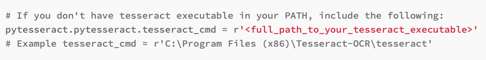
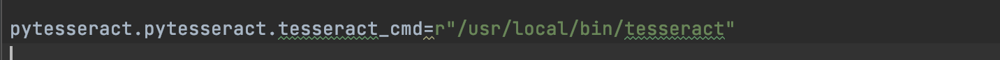
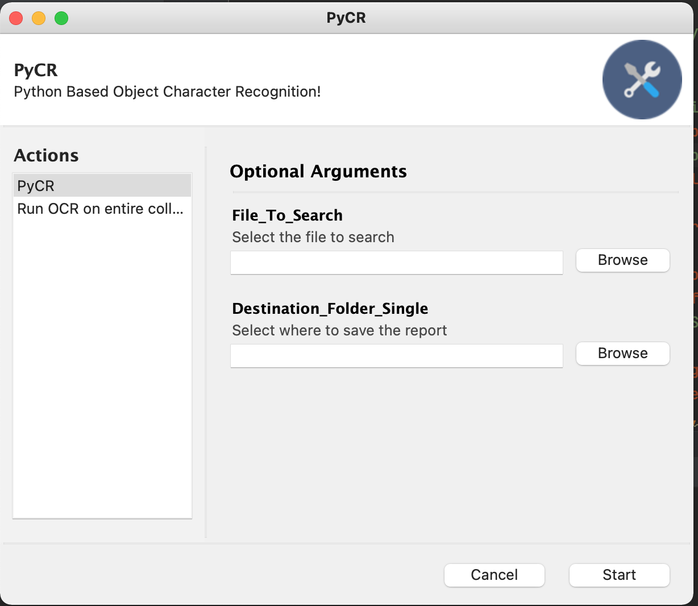
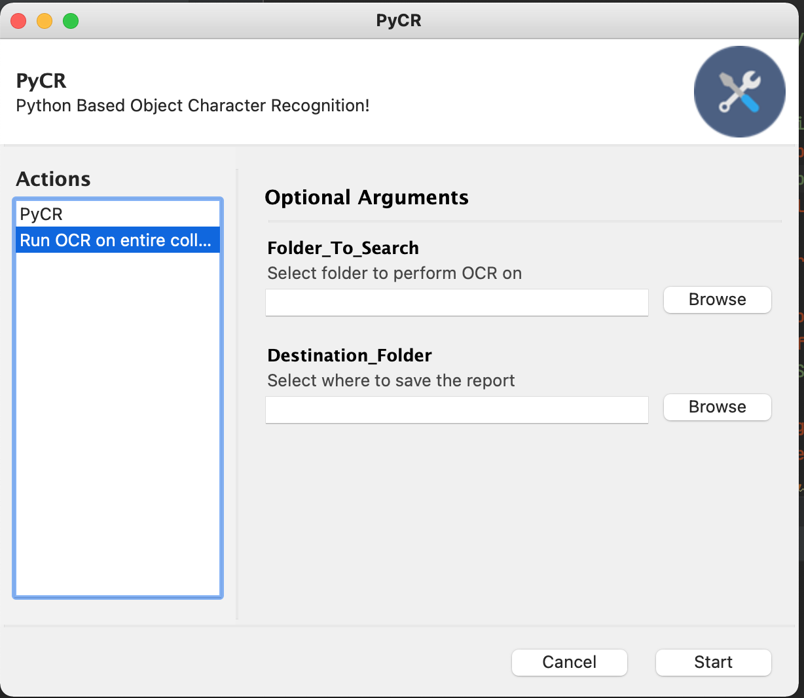

# PyCr
 Python Gui OCR Tool


## Table of contents
* [General info](#general-info)
* [Technologies](#technologies)
* [Setup](#setup)

## General info
This project is simple OCR Python GUI program. It uses existing installations of TesseractOCR on the local system

## Technologies
Project is created with:
* python 3.6<
* pytesseract
* tesseract ocr

## Setup
To run this project, first you need tesseract ocr:


### Windows/Unix/Mac
download it here [get](https://tesseract-ocr.github.io/tessdoc/Installation.html)


## Usage

point script to tesseract location





use pip to install the dependencies

````
$ pip install -r reqs.txt
```


```
$ python main.py
```

### Screenshots






## Future features
* enhaced features
* recursive folder/drive search
* file parsing for compatable image file types (remove need for error catching handling incompatible file types)
* upgrade reporting feature to be dynamic html instead of txt file

